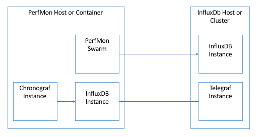
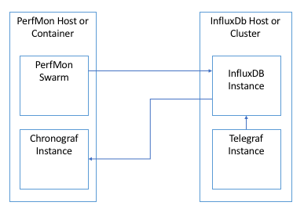

# Influx Performance Monitor

## Version 1.0

## Introduction
This will run a series of performance test on an installation of influxdb.  Tests are fully customizable.  A test can weight the read vs writes.  It can also vary the test data being sent ot InfluxDb.  Specifics of this are below.

## Supported Operating Systems
* CentOS/RHEL/Fedora 7.X
* Ubuntu 14.04LTS or 16.04LTS

## Pre-Requisites
1. InfluxDB is installed on each host to be tested.
2. An instance of InfluxDB to capture our test data.
3. Telegraf is setup on each host to be tested.  Furthermore Telegraf is setup to capture system metrics for each host.
4. Chronograf is setup to access our instance of InfluxDB with our test data
5. Password-less SSH Access has been setup on all nodes and you have the private key

## Dependencies
* LocustIO -- http://docs.locust.io/en/latest/index.html

## Installation
There are two ways that this framework can be setup for testing.  One will use the same instance eof Influx we are testing to hold our test data.  The other will use a separate instance of Influx.

### Separate Instance (recommended)

1. Install a separate instance of InfluxDB on a host machine (PerfMon).
2. Create the following databases On PerfMon:
* load_testing <-- if you use another db name make sure you set it in the database parameter of the config
* telegraf
3. Install Telegraf on the host we will be testing.  If you are testing an Influx Enterprise setup install Telegraf on each data node.
You should setup telegraf to grab the following metrics:
```yaml
[[inputs.cpu]]
[[inputs.disk]]
[[inputs.diskio]]
[[inputs.mem]]
[[inputs.swap]]
[[inputs.system]]
```
There is a sample telegraf.conf file in the conf directory.  You will have ot change the url to point to the PerfMon host.  By default this will output to the following.
```yaml
[[outputs.influxdb]]
  urls = ["http://localhost:8086"]
  database = "telegraf"
  retention_policy = ""
  write_consistency = "any"
  timeout = "5s"
```
4. Create config.py file to setup test parameters.  Details are below in the configuration section
5. Install Chronograf on the PerfMon host.  Optionally there is a prebuilt dashboard you can upload to Chronograph. On the PerfMon host run the following command:
```bash
curl -i -X POST -H "Content-Type: application/json" http://localhost:8888/chronograf/v1/dashboards \
-d @/conf/InfluxDB_Monitor_Dashboard.json
```
6. Install Locustio on the PerfMon host:
```bash
    pip install locustio
```

### Same Instance

1. Create the following databases on your InfluxDB instance:
* load_testing <-- if you use another db name make sure you set it in the database parameter of the config
* telegraf
3. Install Telegraf on the host we will be testing.  If you are testing an Influx Enterprise setup install Telegraf on each data node.
You should setup telegraf to grab the following metrics:
```yaml
[[inputs.cpu]]
[[inputs.disk]]
[[inputs.diskio]]
[[inputs.mem]]
[[inputs.swap]]
[[inputs.system]]
```
There is a sample telegraf.conf file in the conf directory.  You will have ot change the url to point to the PerfMon host.  By default this will output to the following.
```yaml
[[outputs.influxdb]]
  urls = ["http://localhost:8086"]
  database = "telegraf"
  retention_policy = ""
  write_consistency = "any"
  timeout = "5s"
```
4. Create config.py file to setup test parameters.  Details are below in the configuration section
5. Install Chronograf on the PerfMon host.  Optionally there is a prebuilt dashboard you can upload to Chronograph. On the PerfMon host run the following command:
```bash
curl -i -X POST -H "Content-Type: application/json" http://localhost:8888/chronograf/v1/dashboards \
-d @/conf/InfluxDB_Monitor_Dashboard.json
```
When you start Chronograf you will need to register your InfluxDB host.
6. Install Locustio on the PerfMon host:
```bash
    pip install locustio
```

Alternatively you could put everything on the host to be tested, but this may skew the system load data being generated by Telegraf.

## Usage
```python
nohup locust -f /vagrant/locustfile.py --host=http://[influxDB host to be tested]:8086 > locust.log
```
OR
```python
env DG_CONFIG=[path/to/custom/config/file] nohup locust -f /vagrant/locustfile.py --host=http://[influxDB host to be tested]:8086 > locust.log
```

## Input Data
The test framework will accept data in one of two ways

1. Randomly generated at runtime as defined by the configuration parameters below
2. A file with pre generated data points in line protocol.  (see the filename parameter in Configuration and Generating Data below).

## Generating Test Data
You can also pre-generate data with the script generateData.py.  This script will look for a config file with the parameters below and create a file with randomly generated points defined by the following parameters:
* filename -- The name of the output file for our generated data
* maxBatchSize -- See below
* maxMeasurements -- See below
* tags OR (minTags AND maxTags) -- See below
* maxTagValueLength -- see below
* fields OR (minFields AND maxFields) -- See below
* fieldTypeWeights -- See below
* maxFieldStrValueLength -- See below
* maxFieldNumericValue -- See below
* maxDecimalValueLength -- See below

## Configuration
Test configuration is specified in JSON file.  This file path can be passed in at runtime.
You can pass in a custom configuration either by editing the conf/config.json file or passing in a custom path by setting the `DG_CONFIG` environment variable:
```python
export DG_CONFIG=[path/to/custom/config/file]
```
OR by pre=pending the following when you launch"
```python
env DG_CONFIG=[path/to/custom/config/file]
```
If a custom path is not specified the system will look for a config file at conf/config.json.  If that is not found it will exit with a -1 exit code.
The default configuration settings are in the config.py file.  Any values passed in from a custom config or conf/config.json will overwrite these values

### influxURL
The URL of the InfluxDB we will be testing against
* Default Value: http://localhost:8086

### database
The name of the database to use for our test
* Default Value: load_testing

### min_wait
The minimum time respectively, in milliseconds, that a simulated user will wait between executing each task

[http://docs.locust.io/en/latest/writing-a-locustfile.html](http://docs.locust.io/en/latest/writing-a-locustfile.html)
* Default Value: 1000

### max_wait
The maximum time respectively, in milliseconds, that a simulated user will wait between executing each task

[http://docs.locust.io/en/latest/writing-a-locustfile.html](http://docs.locust.io/en/latest/writing-a-locustfile.html)
* Default Value: 1000

### readWeight
The weighted value for reads vs writes. This is expressed as a ratio.  So if readWeight is 3 and writeWeight is 1 the 3 read queries will execute for each write query.
* Default Value:  1

### writeWeight
The weighted value for reads vs writes. This is expressed as a ratio.  So if readWeight is 3 and writeWeight is 1 the 3 read queries will execute for each write query.
* Default Value: 50

###filename
Optionally you can also pass in a file name that contains points in lineProtocol.  This file can contain as many points as you want.  Caution should be used not to make the file too large though as that may have a negative effect on the testing.  If you specify a filename it will override the following settings:
* numMeasurements
* minTags
* maxTags
* tags
* minFields
* maxFields
* fields

* Default Value: empty string

### minBatchSize
The minimum batch size of points to send with each write request. For each batch written to the database we will create a batch where minBatchSize ≤ n ≤ maxBatchSize.
* Default Value: 5000

### maxBatchSize
The minimum batch size of points to send with each write request. For each batch written to the database we will create a batch where minBatchSize ≤ n ≤ maxBatchSize.
* Default Value: 10000

### numMeasurements
The maximum number of measurements our test should create.  This cannot be less than 1 or less than minMeasurements. With the exception that if it -1 then there is no limit (use this with caution). The name of the measurement will be a random string created at runtime.
* Default Value: 1

### measurements
Alternatively instead of setting minMeasurements and maxMeasurements, you can define your measurements manually here.  This is an array of strings and will override minMeasurements and maxMeasurements.
```json
["myMeasurement", "myOtherMeasurement"]
```
* Default Value: []

### minTags
The minimum number of tags to create.  This cannot be less than one or larger than maxTags. Tag names and values will be randomly defined at test time.
* Default Value: 1

### maxTags
The maximum number of tags to create.  This cannot be less than one or smaller than minTags. Tag names and values will be randomly defined at test time.
* Default Value: 1

### maxTagValueLength
The maximum length of a tag value randomly created for a write. This number will have an affect on the maximum series cardinality.  The larger this number is the higher your potential series cardinality can be.  Series cardinality is defined as the cartesian product of the set of measurements, the set of tags, and retention policy.  For example if we have a database with one measurement and 2 tags:

* TagA - 100 Possible values
* TagB - 10 possible values

Then our maximum possible series cardinality would be 1000: (100 * 10) * 1 = 1000.  Randomly created tag values are all strings so in general the effect of this value can be log26(maxCardinality)

* Default Value: 12

### tags
Conversely instead of setting minTags and maxTags, you can define your tags manually here.  This is an array of tags with each tag containing the following configuration parameters
```json
[ "myTag", "myOtherTag" ]
```
* name - The name of the tag
* cardinality - The max cardinality for the tag. The total of the cardinality of all tags defined here will override the maxSeriesCardinality value.  So use this with caution.

Tag values will be randomly defined at test time.

* Default Value: []

### minFields
The minimum number of fields to create.  This cannot be less than one or larger than maxFields. Field names and values will be randomly defined at test time.
* Default Value: 1

### maxFields
The maximum number of fields to create.  This cannot be less than one or larger than minFields. Field names and values will be randomly defined at test time.
* Default Value: 1

### maxFieldStrValueLength
The maximum length of the value of a string field.  Field values are randomly created at runtime.
* Default Value: 12

### maxFieldNumericValue
The maximum scalar value of an integer or float field. Field values are randomly created at runtime.
* Default Value: 100000

### maxDecimalValueLength
How many decimals each float value will have.  Float values are randomly determined at runtime by the following formula random.int(0, maxFieldNumericValue) / pow(10, maxDecimalValueLength)
* Default Value: 2

### fields
Conversely instead of setting minFields and maxFields, you can define your fields manually here.  This is an array of fields with each field containing the following configuration parameters
```json
[
	{
	"name": "myField",
	"type": "string"
	},
	{
	"name": "myOtherField",
	"type": "int"
	}
]
```
* name - The name of the tag
* type -- The data type of the field.  This can be any legal datatype for InfluxDB as described in [https://docs.influxdata.com/influxdb/v1.2/write_protocols/line_protocol_tutorial/](https://docs.influxdata.com/influxdb/v1.2/write_protocols/line_protocol_tutorial/):

	* float
	* int
	* string
	* boolean

Field values will be randomly defined at test time.

* Default Value: []

### fieldTypeWeights
An array containing the weighted value for randomly generated fields.

* Default Values:
```json
[
	{
        "string": 40
    },
    {
        "int": 25
    },
    {
        "float": 25
    },
    {
        "boolean": 10
    }
]
```

In the above example for every 100 randomly generated fields, 40 of them should be strings, 25 should be ints, 25 should be floats, and 10 should be booleans.  Bear in mind that these values are just weights and not hard limits.

## Testing
The test folder contains a Vagrantfile and scripts that you can use to automatically setup a PerfMon host with everything pre-installed.